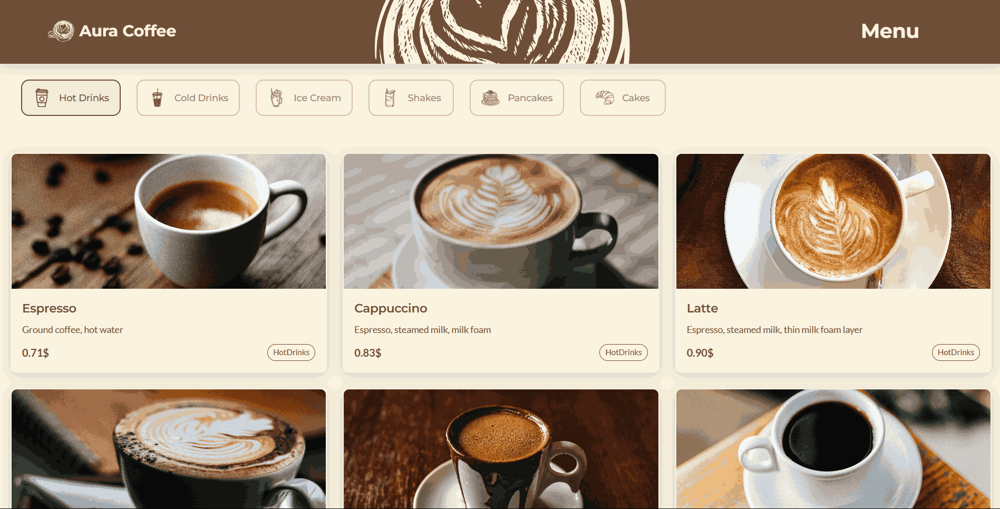
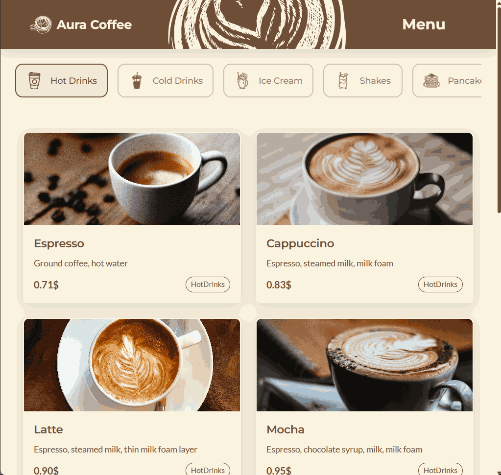
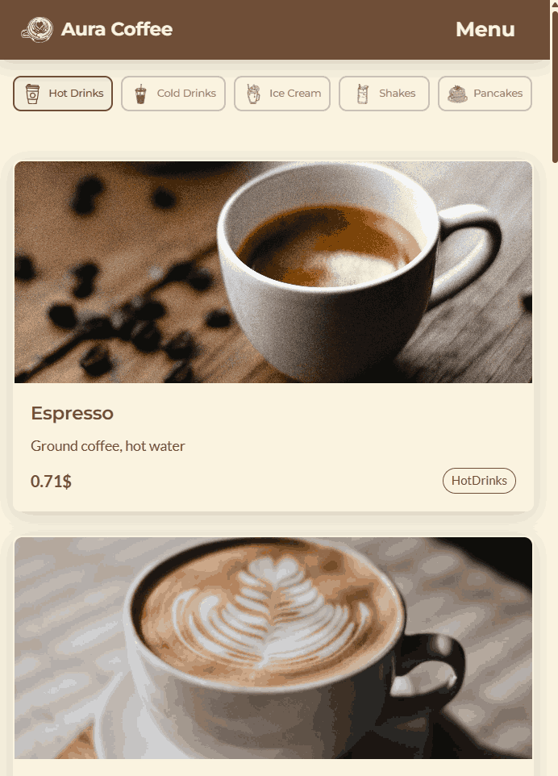

# Digital Cafe Menu

A modern and responsive digital menu for cafes, built with React and Tailwind CSS using Vite. This project allows customers to scan QR codes to access the menu, view detailed items with images, descriptions, and prices, providing a seamless contactless ordering experience.

---

## Features

- Easy-to-use interface for browsing the menu
- Fully responsive design with Tailwind CSS
- Support for QR code scanning for quick access
- Dynamic display of menu items, including images, descriptions, and prices
- Easy customization and extension for different cafe menus

---

## Technologies Used

- React
- Tailwind CSS
- Vite
- JavaScript (ES6+)

---

## Project Screenshots


|  |  |

---

## Getting Started

### Prerequisites

- Node.js (v14+ recommended)
- npm or yarn

### Installation

1. Clone this repository:
```bash
git clone https://github.com/SaliTech-official/AuraCoffee.git
```

2. Navigate to the project folder:
```bash
cd AuraCoffee
cd app
```

3. Install dependencies:
```bash
npm install
# or
yarn install
```

4. Run the development server:
```bash
npm run dev
# or
yarn dev
```

Your app will be available at `http://localhost:5173` (or another port depending on Vite's configuration).

---

## Usage

- To scan a QR code, use a compatible QR code scanner app or browser extension that can access your camera.
- Once scanned, the app will load the specific menu associated with that QR code, showing all items with images, descriptions, and prices.
- Customize menu items by editing the JSON or data files in the project.

---

## Contributing

Contributions are welcome! Please submit a pull request or open an issue for feature requests or bugs.

---

## License

This project is licensed under the CC BY-NC License.

---

## Contact

For questions, contact [salitech.2008@gmail.com](mailto:salitech.2008@gmail.com)
